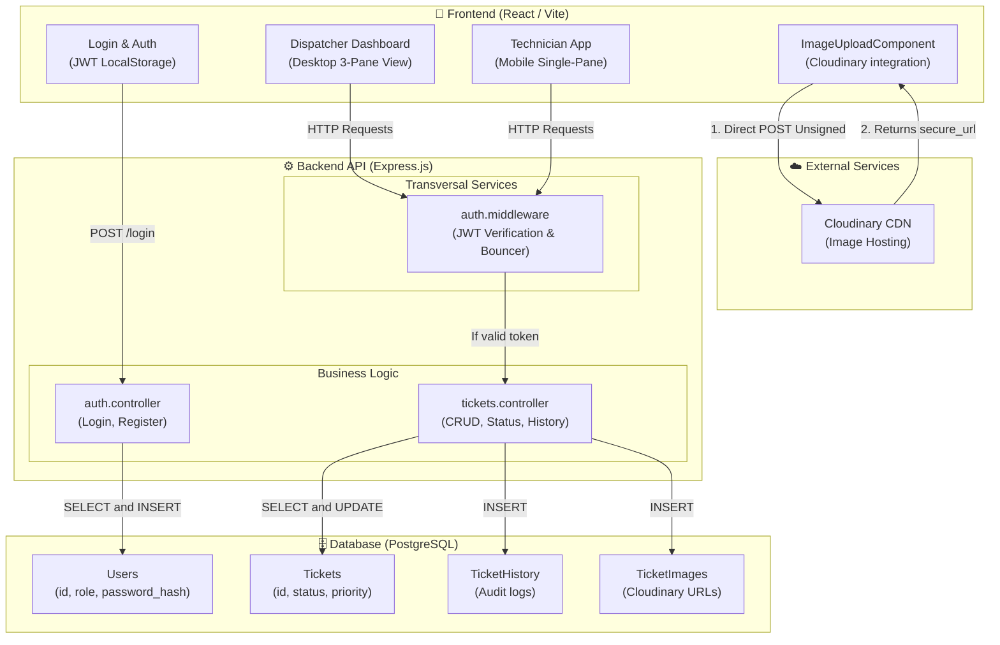
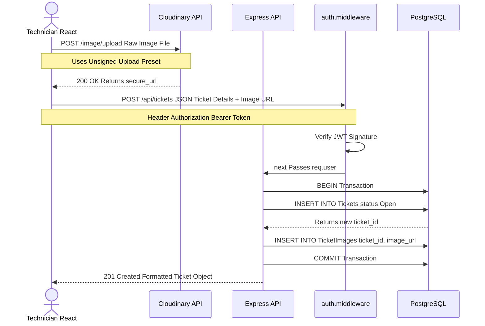

# FIXIT-CORE-ARC-COMPONENTS-v1.0
# Component & Architecture Diagram — FixIt Campus (SGM)

**Project:** FixIt Campus (SGM)  
**Version:** 1.0  
**Date:** 2026-04-16  

---

## General System View (System Context)

---

## Module Descriptions

| Module / Component | Primary Responsibility | Dependencies |
|---|---|---|
| **React UI App** | Rendering the responsive Master-Detail layout and capturing user inputs. | `REST API`, `Cloudinary` |
| **auth.controller** | Verifying credentials, hashing passwords, generating JWTs. | `Users` Table, `bcrypt`, `jsonwebtoken` |
| **tickets.controller** | Core CRUD operations, mapping API contracts, ensuring audit logs are created on updates. | `Tickets`, `TicketHistory`, `TicketImages` Tables |
| **auth.middleware** | The "Bouncer". Intercepts requests to verify JWT signatures before allowing access. | `jsonwebtoken` |
| **PostgreSQL DB** | The single source of truth for all structured relational data. | — |
| **Cloudinary** | Processing and hosting heavy image files to keep the Express server unblocked. | — |

---

## Core Flow: Creating a Ticket with Evidence

Because our architecture uses a **Frontend-Direct-to-Cloudinary** pattern to reduce server load, the flow of creating a ticket with an image requires specific orchestration between the client, the external CDN, and our database.

